# ***Supermarkets Sales Analysis Project:***

# **1. Introduction:**
In this project, I will analyze the dataset from three market branches (A, B,C) using Python programming language using Jupyter Notebook to analyze the exported dataset by cleaning it, then describe statistical characteristics (Mean - Median- IQR - Min - Max), and find trends and insights between customers and different branches and products, to try to improve the total profit and the customers of the branches, by using (Pandas Library), and finally visualize the data using different python libraries such as (Matplotlib - Seaborn - Plotly), to show different trends and patterns between the data.

You can see all Python Jupyter Notebooks [here](Python_Analysis).

# **2. Tools I Used:**
**1. Python:** as it a powerhouse in data analysis, thanks to its `simplicity`, `flexibility`, and the vast array of libraries it offers.

**2. Visual Studio Code:** for `Python coding` for `analysis`.

**3. Jupyter Notebook:** as it an interactive web-based environment that allows users to create and share documents `containing live code`, `visualizations`, and `narrative text`, using Python language.

**4. Git & GitHub:** for sharing Python analysis and interpretation.

# **3. Data Inspection Step:**
The Data Inspection step in pandas, or `data exploration`, is the initial process of examining and understanding the dataset. It involves methods, to get a basic overview of the data, including its `structure`, `dimensions`, `data types`, and `summary statistics`.

```py
df.info()
```

```py
columns = ['Branch', 'City', 'Customer type', 'Gender','Product line', 'Payment']

for column in columns:
    print(f"{column}: Unique Values = {df[column].unique()}")
    print("---------------------------------------------------")
```
```py
df.describe()
```
# **4. Data Cleaning Step:**
**1. Create A Copy Of The Main Data Frame:**
```py
df_copy = df.copy()
```
**2. Rename All Column Names Into Lower Case Letters And Remove Spaces:**
- **First Way:**
```py
for column in df_copy.columns:
    df_copy.rename(columns={column:(column.lower()).replace(" ", "_")}, inplace=True)
```
- **Second Way:**
```py
df_copy.columns = df_copy.columns.str.lower()
df_copy.columns = df_copy.columns.str.replace(' ', '_')
```
**3. Merge Columns (Date & Time) Then Convert Them To Datetime Data Type:**

**3.1. Merage Date Column With Time Column:**
```py
for index, row in df_copy.iterrows():
    df_copy["date"][index] = ((df_copy["date"][index]) + " " + df_copy["time"][index])
```
**3.2. Rename Column (date) To (date_time):**
```py
df_copy.rename(columns={
    "date":"date_time"
}, inplace=True)
```
**3.3. Delete Column (time):**
```py
df_copy.drop(columns="time", inplace=True)
```
**3.4. Convert New Column (date_time) Into Date Time Data Type:**
```py
df_copy["date_time"] = pd.to_datetime(df_copy["date_time"])
```
**4. Save Cleaned Dataframe Into A CSV To Analysis It:**
```py
df_copy.to_csv("cleaned_supermarket_sales.csv", index_label=False)
```
# **5. Python Analysis (VS Code & Jupyter Notebook):**
`Python` offers a rich ecosystem of libraries like `Pandas`, `Matplotlib`, and `Plotly`,  providing powerful tools for data analysis. In `univariate analysis`, Python excels at summarizing single variables using functions like mean(), median(), and mode(), and creating insightful visualizations with libraries like Matplotlib and Seaborn. For `bivariate analysis`, Python facilitates the exploration of relationships between two variables through bar and line plots. In `multivariate analysis`, Python enables it through scatter plots analysis, correlation analysis, and hypothesis testing.

# **5.1.Univariate Analysis:**
### **5.1.1.Univariate Analysis Of Numerical (Quantitative) Columns**

### **(1) Frequency Of Numerical Columns Using (Histogram):**

```py
numerical_columns = df.select_dtypes('number')
numerical_columns.columns.nunique()
```
### **Using Matplotlib Library:**
**First Way:**
```py
fig, ax = plt.subplots(4,2, figsize=(22,20))

ax[0,0].hist(data=numerical_columns, x="unit_price", edgecolor='black')
ax[0,1].hist(data=numerical_columns, x="quantity", edgecolor='black')
ax[1,0].hist(data=numerical_columns, x="tax_5%", edgecolor='black')
ax[1,1].hist(data=numerical_columns, x="total", edgecolor='black')
ax[2,0].hist(data=numerical_columns, x="cogs", edgecolor='black')
ax[2,1].hist(data=numerical_columns, x="gross_margin_percentage", edgecolor='black')
ax[3,0].hist(data=numerical_columns, x="gross_income", edgecolor='black')
ax[3,1].hist(data=numerical_columns, x="rating", edgecolor='black')

ax[0,0].set_title("Distribution Of Unit Price")
ax[0,1].set_title("Distribution Of Quantity")
ax[1,0].set_title("Distribution Of Tax_5")
ax[1,1].set_title("Distribution Of Total")
ax[2,0].set_title("Distribution Of Cogs")
ax[2,1].set_title("Distribution Of Gross Margin Percentage")
ax[3,0].set_title("Distribution Of Gross Income")
ax[3,1].set_title("Distribution Of Rating")

ax[0,0].set_ylabel("Frequency")
ax[0,1].set_ylabel("Frequency")
ax[1,0].set_ylabel("Frequency")
ax[1,1].set_ylabel("Frequency")
ax[2,0].set_ylabel("Frequency")
ax[2,1].set_ylabel("Frequency")
ax[3,0].set_ylabel("Frequency")
ax[3,1].set_ylabel("Frequency")

ax[0,0].set_xlabel("Unit Price")
ax[0,1].set_xlabel("Quantity")
ax[1,0].set_xlabel("Tax_5")
ax[1,1].set_xlabel("Total")
ax[2,0].set_xlabel("Cogs")
ax[2,1].set_xlabel("Gross Margin Percentage")
ax[3,0].set_xlabel("Gross Income")
ax[3,1].set_xlabel("Rating")

plt.tight_layout()
```
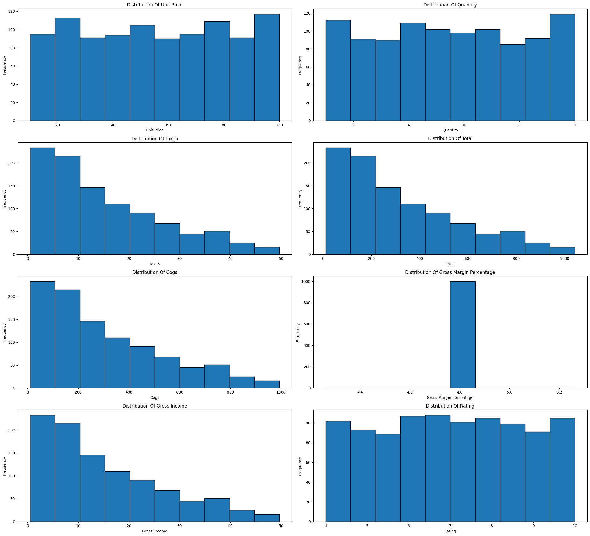
---

**Second Way:**
```py
plt.figure(figsize=(25,25))

for index, col in enumerate(numerical_columns.columns):
    plt.subplot(4,2, (index+1))
    plt.hist(x=numerical_columns[col], edgecolor='black', color='green')
    plt.title(f"Distribution Of {(col.capitalize()).replace('_', ' ')}")
    plt.xlabel(f"{(col.capitalize()).replace('_', ' ')}")
    plt.ylabel('Frequency')
    plt.tight_layout()
```
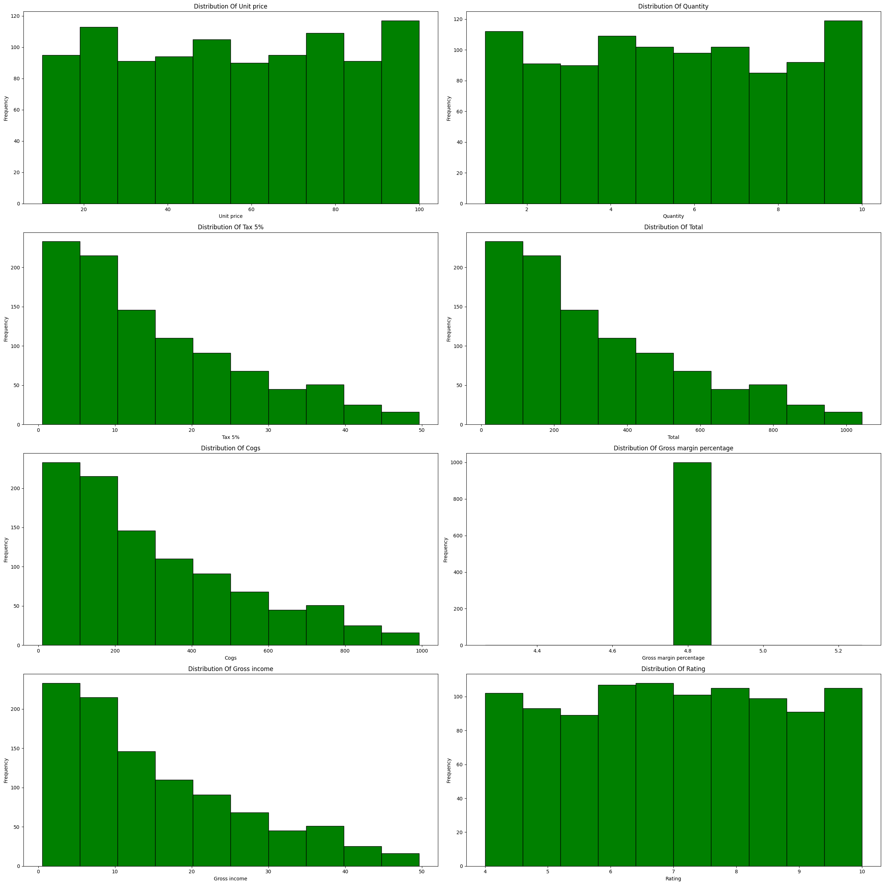
---

**Third Way:**
```py
fig, ax = plt.subplots(4,2, figsize=(25,22))

for index, column in enumerate(numerical_columns.columns):
    row = index // 2
    col = index % 2
    ax[row,col].hist(x=numerical_columns[column], edgecolor='black', color='orange')
    ax[row, col].set_ylabel("Frequency")
    ax[row, col].set_xlabel(f"{(column.capitalize()).replace('_', ' ')}")
    ax[row,col].set_title(f"Distribution Of {(column.capitalize()).replace('_', ' ')}")
    plt.tight_layout()
```
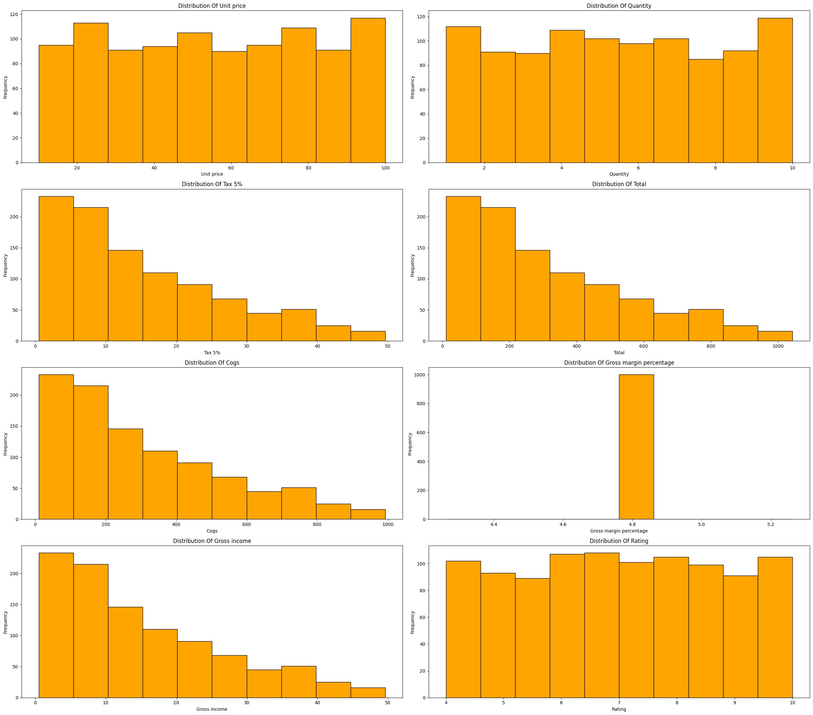
---

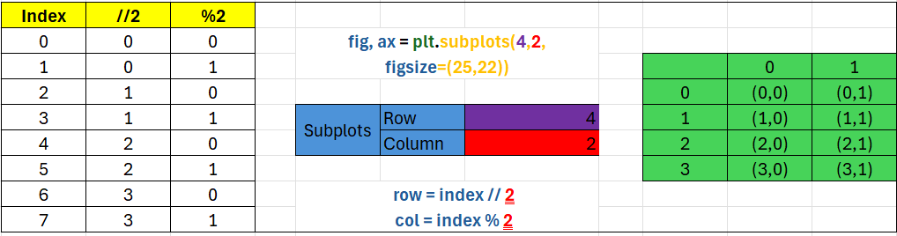
---

### **Using Seaborn Library:**
```py
plt.figure(figsize=(25,22))

for index, col in enumerate(numerical_columns.columns):
    plt.subplot(4,2, (index +1))
    sns.histplot(numerical_columns[col], color='purple', kde=True, edgecolor='black')
    plt.title(f"Distribution Of {(col.capitalize()).replace('_', ' ')}")
    plt.xlabel(f"{(col.capitalize()).replace('_', ' ')}")
    plt.ylabel('Frequency')
    plt.tight_layout()
```
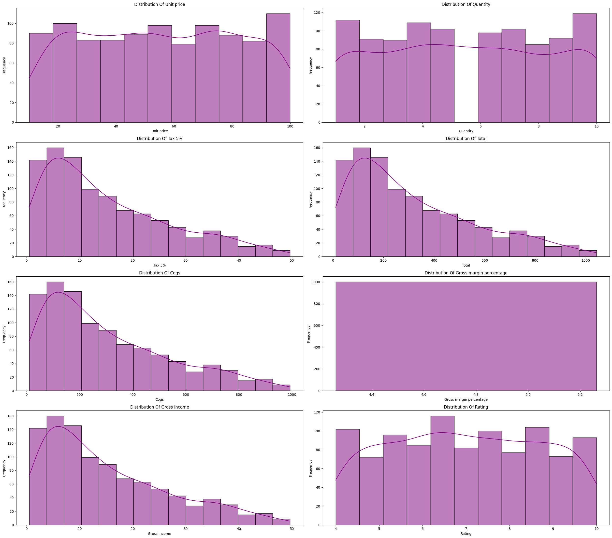
----

From the analysis of the `distribution` of the `numerical columns` of the data, we will focus on the shape distribution of this columns:

1. `Distribution Of Tax_5.`
2. `Distribution Of Total.`
3. `Distribution Of Cogs.`
4. `Distribution Of Gross Income.`

**Distribution Of Main Numerical Columns (Histogram):**

```py
plt.figure(figsize=(20,10))

for index, col in enumerate(selected_numerical_columns.columns):
    plt.subplot(2,2, index+1)
    sns.histplot(
        selected_numerical_columns[col],
        color='darkblue',
        edgecolor="black",
        kde=True
    )
    plt.title(f"Distribution Of {(col.capitalize()).replace("_", " ")}")
    plt.xlabel(f"{(col.capitalize()).replace("_"," ")}")
    plt.ylabel("Frequency")
    plt.tight_layout()
```
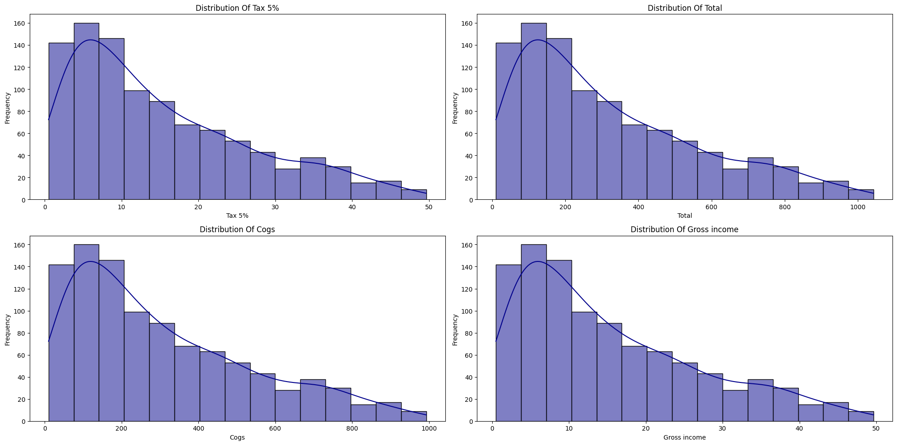
---

**`Histograms Analysis:`**

- All four histograms show a right-skewed distribution, meaning there are a larger number of smaller values and fewer larger values, this indicates that the majority of the data points are concentrated towards the lower end of the range.

- We note that `Mean` > `Median`, so `Median` Is Suitable to Use Not `Mean`

**`Individual Histogram Analysis:`**

1. `Distribution of Tax_5:`

- The distribution is heavily concentrated between 0 and 20.
- There's a sharp decline in frequency beyond 20.
- This suggests that a large portion of the transactions have a tax rate below 20%.

2. `Distribution of Total:`

- The distribution is also right-skewed with a peak around 200.
- The frequency gradually decreases as the total amount increases.
- This indicates that most transactions have a total value below 200.

3. `Distribution of Cogs:`

- Similar to the other distributions, it's right-skewed with a peak around 200.
- The frequency tails off as the cost of goods sold increases.
- This suggests that a majority of the products have a cost of goods sold below 200.

4. `Distribution of Gross Income:`

- This distribution is also right-skewed with a peak around 10.
- The frequency decreases as the gross income increases.
- This indicates that most transactions have a gross income below 10.

**From the distribution of this selected `Quantitative` (`Numerical`) columns:**

1. All Columns Histogram (Shape Of The Curve) Are `Right-Skewed Curve` (`Positive Skewed`).
2. `Mean` > `Median`.
3. `Median` Is Suitable to Use Not `Mean`.
4. We Will Use `Box Plot` to Find Five Number Summary, And Identify The `Outliers`.

### **Describe Five Number Summary:**
**We used five number summary to find the `outliers` in our data, a `five-number summary` simply consists of the smallest data value (`Min`), the first quartile (`Q1`), the median (`Q2`), the third quartile (`Q3`), and the largest data value (`Max`).**
-	`Min`
-	`Q1`
-	`Median`
-	`Q3`
-	`Max`

```py
numerical_columns.describe().round(2)
```
### **(2) Box Plot Of Selected Quantitative (Numerical) Columns:**

**Using Seaborn Library:**

```py
plt.figure(figsize=(18,10))

for index, col in enumerate(selected_numerical_columns.columns):
    plt.subplot(2,2, (index+1))
    sns.boxplot(
        x=selected_numerical_columns[col],
        label=((col.capitalize()).replace("_", " ")),
        vert=False
    )
    plt.title(f"Box Plot Of {(col.capitalize()).replace("_", " ")}")
    plt.xlabel((col.capitalize()).replace("_", " "))
    plt.tight_layout()
```
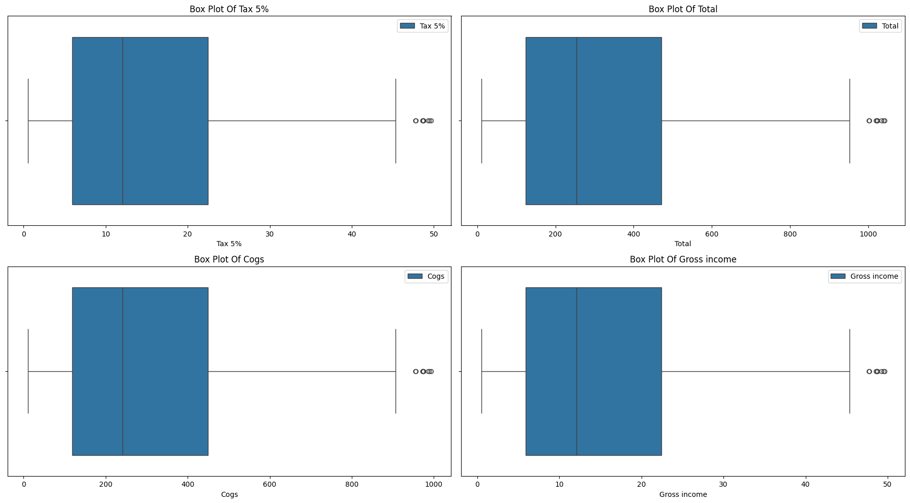
---

**Using Matplotlib Library:**
```py
fig, ax = plt.subplots(2,2, figsize=(13,7))

for index, column in enumerate(selected_numerical_columns.columns):
    row = index // 2
    col = index % 2
    ax[row,col].boxplot(selected_numerical_columns[column], vert=False)
    ax[row,col].set_title(f"Box Plot Of {(column.capitalize()).replace("_", " ")}")
    ax[row,col].set_xlabel(f"{(column.capitalize()).replace("_", " ")}")
    ax[row,col].set_yticks([])
    ax[row,col].set_ylabel(f"{(column.capitalize()).replace("_", " ")}", rotation=0, labelpad=50)
    ax[row,col].axvline(x=(selected_numerical_columns[column].mean()), color='red', linestyle='--')
    ax[row,col].axvline(x=(selected_numerical_columns[column].median()), color='green', linestyle='--')
    ax[row,col].axvline(x=(selected_numerical_columns[column].quantile(0.25)), color='blue', linestyle='--')
    ax[row,col].axvline(x=(selected_numerical_columns[column].quantile(0.75)), color='red', linestyle='--')

    fig.suptitle("Box Plots Of Numerical Columns", fontsize=15)
    fig.tight_layout()
```
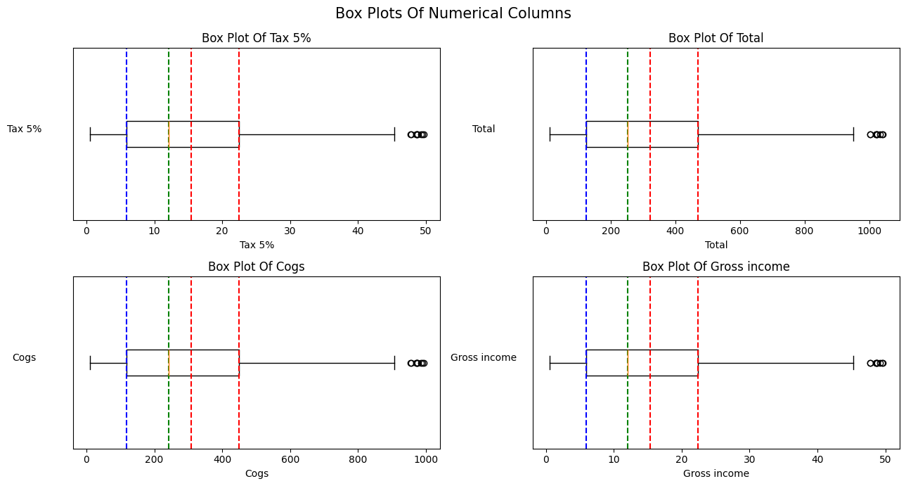
----

### **5.1.2.Univariate Analysis Of Categorical (Qualitative) Columns**

- In This Step We Will Focus On Important `Categorical` Columns:
    1. `branch`
    2. `city`
    3. `customer_type`
    4. `gender`
    5. `product_line`
    6. `payment`

### **(1) Analysis Of Branch Cateogrical Column:**

```py
branch_frequency = df["branch"].value_counts().sort_values(ascending=False)

plt.figure(figsize=(12,3))
plt.barh(branch_frequency.index, branch_frequency.values, color='green')
plt.title("Frequency Of Branchs")
plt.ylabel("Branch")
plt.xlabel("Frequency")
plt.gca().invert_yaxis()
plt.tight_layout()
```
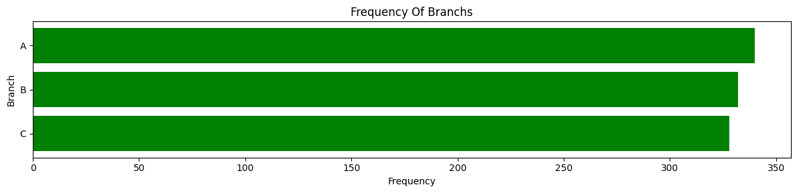
---

**`Chart Analysis:`**

- The chart reveals an uneven distribution of activity across the three branches. Branch A appears to be the most active, followed by Branch B, and then Branch C. This suggests potential imbalances in workload, resources, or performance across the branches.

### **(2) Analysis Of City Cateogrical Column:**

```py
city_frequency = df["city"].value_counts().sort_values(ascending=False)

sns.barplot(city_frequency, color='red', width=0.5)
plt.title("Frequency Of Citys")
plt.xlabel("City")
plt.ylabel("Frequency")
plt.tight_layout()
```
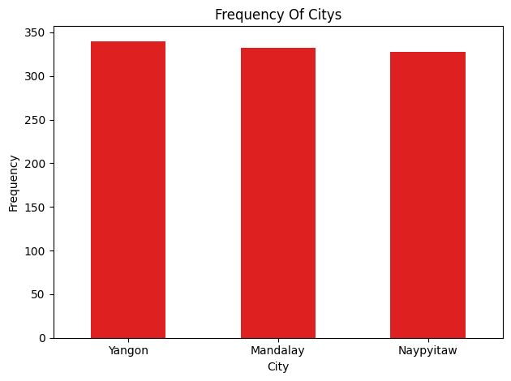
---

**`Chart Analysis:`**

- The chart shows a relatively even distribution of frequency across Yangon, Mandalay, and Naypyitaw. However, Yangon exhibits slightly higher activity compared to the other two cities. This suggests that while the overall distribution is balanced, there might be a slightly higher demand or activity in Yangon.

### **(3) Analysis Of Customer Type Cateogrical Column:**

```py
customer_type_fq = df["customer_type"].value_counts().sort_values(ascending=False)

plt.bar(customer_type_fq.index, customer_type_fq.values, color='orange', width=0.5)
plt.title("Customer Type Frequency")
plt.xlabel("Customer Type")
plt.ylabel("Frequency")
plt.tight_layout()
```
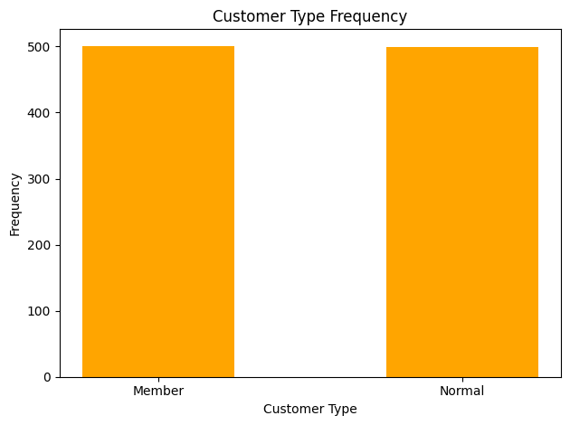
---

**`Chart Analysis:`**

- The chart shows a nearly equal distribution of frequencies between `Member` and `Normal` customers. This indicates a balanced customer base with a healthy mix of members and non-members. The slight edge towards `Normal` customers might suggest opportunities to further incentivize membership.


### **(4) Analysis Of Gender Type Cateogrical Column:**

```py
gender_frequency = df["gender"].value_counts().sort_values(ascending=False)

plt.bar(gender_frequency.index, gender_frequency.values, color=['pink', 'blue'], width=0.5)
plt.title("Gender Frequency")
plt.xlabel("Gender")
plt.ylabel("Frequency")
plt.tight_layout()
```
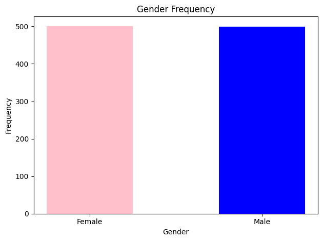
---

**`Chart Analysis:`**

- From this chart The frequency count for `females` is 501, while for `males` it is 499, indicating a slight discrepancy in the gender distribution.

### **(5) Analysis Of Product Line Cateogrical Column:**
```py
product_frequency = df["product_line"].value_counts().sort_values(ascending=False)

plt.figure(figsize=(14,4))
plt.barh(
    product_frequency.index,
    product_frequency.values,
    color=['red','orange','yellow','green','blue','purple']
    )
plt.title("Product Line Frequency")
plt.ylabel("Product Line")
plt.xlabel("Frequency")
plt.gca().invert_yaxis()
plt.tight_layout()
```
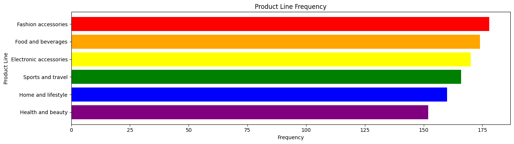
---

**`Chart Analysis:`**

- The bar chart visually represents the frequency of different product lines.

- `Fashion accessories`have the highest frequency, while health and beauty have the lowest.

- The distribution shows a descending pattern from fashion accessories to health and beauty.

- The chart effectively conveys the varying frequencies of each product line.

- The horizontal layout allows for easy comparison between the different categories.

- Overall, the chart effectively communicates the distribution of product line frequencies.

### **(6) Analysis Of Payment Cateogrical Column:**

```py
payment_frequency = df["payment"].value_counts().sort_values(ascending=False)

plt.bar(payment_frequency.index, payment_frequency.values, color=["green", "blue", "red"], width=0.5)
plt.title("Payment Way Frequency")
plt.xlabel("Payment Way")
plt.ylabel("Frequency")
plt.tight_layout()
```
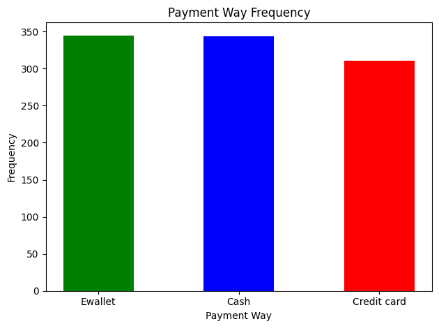
---

**`Chart Analysis:`**

- `E-wallets` are the most popular payment method, followed closely by `cash`, but `credit card` usage is the least frequent. This suggests a preference for digital and convenient payment options among customers. The data can inform business decisions regarding payment infrastructure and marketing strategies to encourage credit card usage.

# **5.2.Bivariate Analysis:**
### **Analysis The Gender Distribution In Each Branch:**
```py
gender_branch_group = df.groupby(by=["branch", "gender"]).agg(
    gender_count=("gender", "size")
)

gender_branch_pivot = gender_branch_group.pivot_table(
    index="branch",
    columns="gender",
    values="gender_count"
)
```

**Using Plot() Pandas Function:**

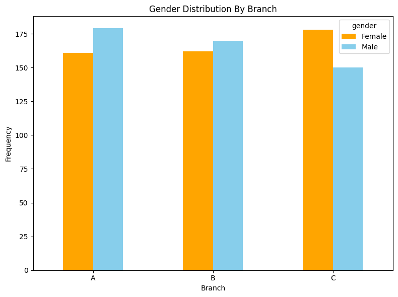
---

**Using Matplotlib Library:**

```py
for column in (gender_branch_pivot.columns.sort_values(ascending=False)):
    plt.plot(
        gender_branch_pivot.index,
        gender_branch_pivot[column],
        label=column,
    )
    plt.legend(loc='best')
    plt.title("Gender Distribution By Branch")
    plt.xlabel("Branch")
    plt.ylabel("Frequency")
    plt.tight_layout()
```
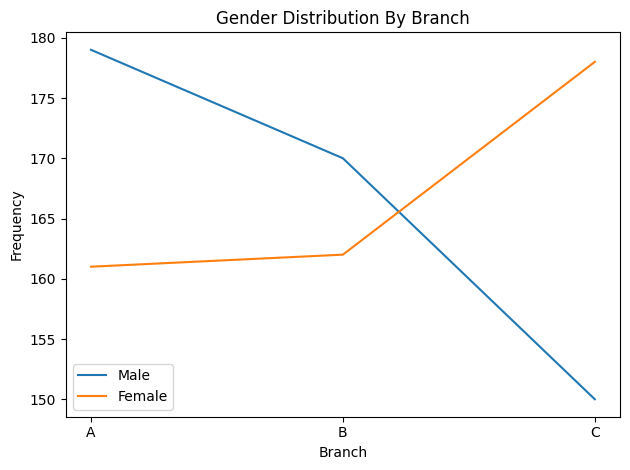
---

**`Chart Analysis:`**

- `Male` (blue) gender is more than `female` (orange) gender in branch (`A`,`B`), expect branch (`c`), in which `female` (orange) gender is more than `male` (blue) gender.


### **Relation Betweem Summation Of Total In All Branchs (A,B,C) Over Date Using Line Chart:**

### **Using Pandas Library:**

```py
date_branch_total_pivot.plot(
    kind='line',
    figsize=(20,6)
)
plt.title("Distribution Of Sum Of The Total Of Branchs")
plt.xlabel("Date")
plt.ylabel("Sum Of Total")
plt.gca().yaxis.set_major_formatter(plt.FuncFormatter(lambda y, position: (f"${int(y)}K")))
plt.xlim(left=date_branch_total_pivot.index.min()) 
plt.tight_layout()
```
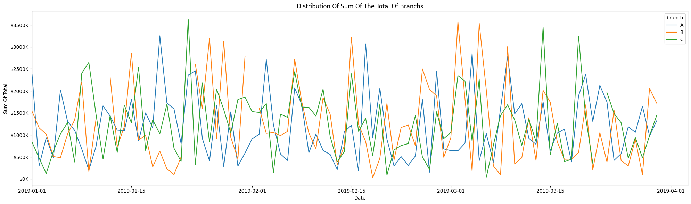
---

### **Using Matplotlib Library:**

```py
plt.figure(figsize=(20,6))
for column in date_branch_total_pivot.columns:
    plt.plot(
        date_branch_total_pivot.index,
        date_branch_total_pivot[column],
        label=[column]
    )
plt.title("Distribution Of Sum Of The Total Of Branchs")
plt.xlabel("Date")
plt.ylabel("Sum Of Total")
plt.xlim(left=date_branch_total_pivot.index.min())
plt.gca().yaxis.set_major_formatter(plt.FuncFormatter(lambda y, position: (f"${int(y)}K")))
plt.tight_layout()
```
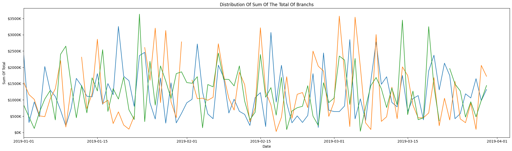
---

**Using Plotly Library:**
```py
px.line(
    date_branch_total_pivot,
    color="branch",
    labels={
        "date":"Date",
        "value":"Sum Of Total In (USD$) "
    },
    title="Distribution Of Sum Of The Total Of Branchs"
)
```
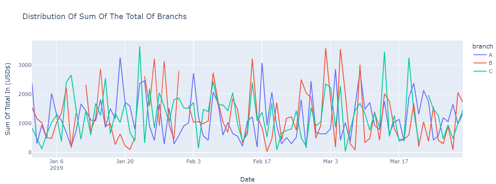
---

**We nedd to observe the highest branch in `summation of total`, so we need to do a `normalization` to make all branchs lines start from same point to easily and clearly comparring between thems, to do this we will divide the total of eash column by day one (`first row`)**

```py
date_branch_total_pivot_normalized = date_branch_total_pivot / date_branch_total_pivot.iloc[0, :]
date_branch_total_pivot_normalized.round(2)
```
**Using Plot() Pandas Library For Plotting Normalized Data:**

```py
date_branch_total_pivot_normalized.plot(
    kind='line',
    figsize=(20,6)
)
plt.title("Distribution Of Sum Of The Total Of Branchs")
plt.xlabel("Date")
plt.ylabel("Sum Of Total")
plt.xlim(left=date_branch_total_pivot_normalized.index.min())
plt.tight_layout()
```
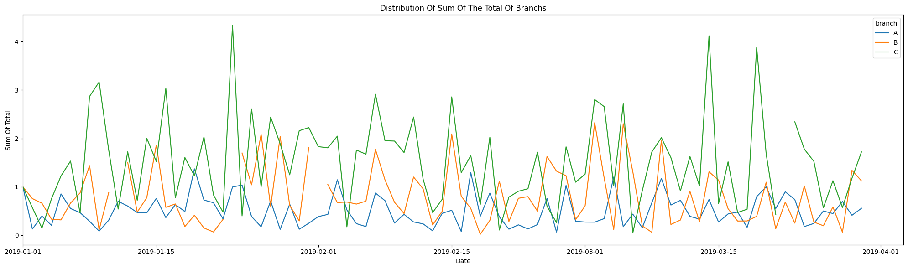
---

**Using Matplotlib Library For Plotting Normalized Data:**

```py
plt.figure(figsize=(20,6))
for column in date_branch_total_pivot_normalized.columns:
    plt.plot(
        date_branch_total_pivot_normalized.index,
        date_branch_total_pivot_normalized[column],
        label=column
    )
plt.title("Distribution Of Sum Of The Total Of Branchs")
plt.xlabel("Date")
plt.ylabel("Sum Of Total")
plt.xlim(left=date_branch_total_pivot_normalized.index.min())
plt.tight_layout()
```

---

**Using Plotly Library:**

```py
px.line(
    date_branch_total_pivot_normalized,
    labels={
        "date":"Date",
        "value":"Sum Of Total"
    },
    title="Distribution Of Sum Of The Total Of Branchs",
    color='branch'
)
```
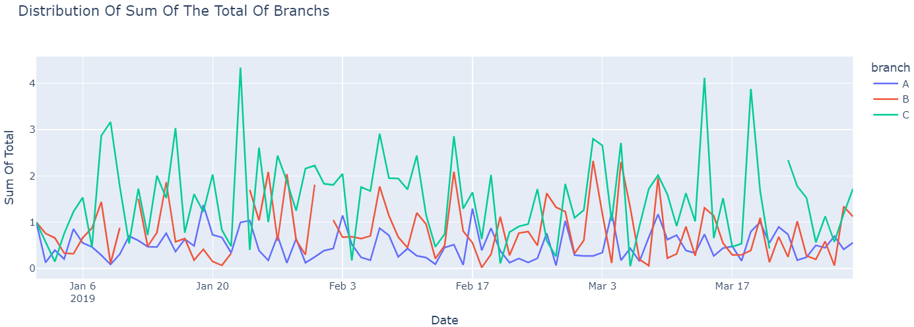
---

**`Chart Analysis:`**

- In the provided chart, the green line (Branch C) consistently appears at the highest level, indicating that Branch C has the highest sum of totals among the three branches throughout the observed period.

- The orange line (Branch B) is generally positioned below Branch C, suggesting a lower sum of totals for Branch B.

- Finally, the blue line (Branch A) is the lowest, indicating the lowest sum of totals among the three branches.

### **Relation Betweem Summation Of Total In All Branchs (A,B,C) Over Date Using Pie Chart:**

```py
branch_total_group = df_copy.groupby(by=["branch"], as_index=False).agg(
    sum_total=("total","sum")
).round(2)
branch_total_group
```

**Using Matplotlib Library:**
```py
branchs = branch_total_group["branch"]
sum_totals = branch_total_group["sum_total"]

plt.figure(figsize=(6,6))
plt.pie(
    sum_totals,
    labels=branchs,
    startangle=90,
    autopct='%1.2f%%',
    colors=["purple", "green", "red"]
)
plt.title("Branchs Total Summation Pie Chart")
plt.tight_layout()
```
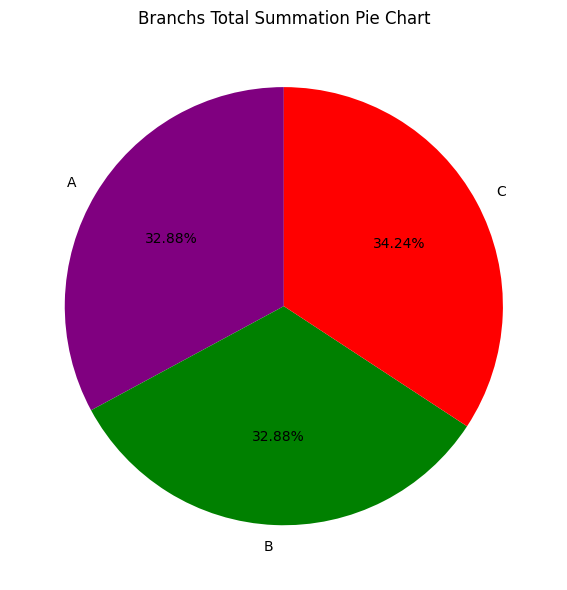
----

**`Chart Analysis:`**

1. The chart shows an unequal distribution among the three branches (A, B, and C). branch C has the largest share, followed by A and B. 
2. Branche C holds a slight majority with 34.24% of the total. 
3. Branches A and B have almost identical shares, both at 32.88%.
4. This indicates that branch C has the largest market share, while branches A and B have smaller but nearly equal shares, and in performance metrics branch C performs best, followed by A and B.

# **5.3.Multivariate Analysis:**

### **Analysis Of Rating Of Female And Male Gender In Each Branch Using Bar Chart:**

```py
gender_branch_rating = df.groupby(by=["branch", "gender"]).agg(
    rating_mean=("rating", "mean")
).round(1)

gender_branch_rating_pivot = gender_branch_rating.pivot_table(
    index="branch",
    columns="gender",
    values="rating_mean"
)

gender_branch_rating_pivot = gender_branch_rating_pivot[["Male","Female"]]

gender_branch_rating_pivot.plot(kind="bar", figsize=(6,5))
plt.title("Gender Rating Mean In Each Branch")
plt.xlabel("Branch")
plt.ylabel("Rating Mean")
plt.legend(loc="best", title="Gender")
plt.xticks(rotation=0)
plt.tight_layout()
```
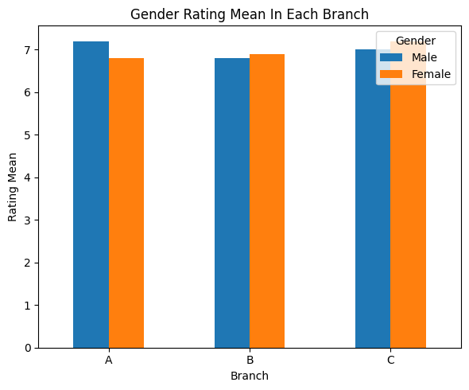
---
**`Chart Analysis:`**
- Branch A Male has the highest rating than female unlike branches (B, C), in which females have the highest rating.

### **Analysis Of Rating Of Female And Male Gender In Each Branch Using Scatter Plot:**

```py
gender_branch_rating = df.groupby(by=["gender","branch"]).agg(
    rating_mean=("rating", "mean")
).round(1)

gender_branch_rating.reset_index(level=1, inplace=True)

color_map = {
    "Female":"orange",
    "Male":"blue"
}

color_list = []
for gender in gender_branch_rating.index:
    color_list.append(color_map[gender])


plt.figure(figsize=(6,5))
plt.scatter(
    x=gender_branch_rating["branch"],
    y=gender_branch_rating["rating_mean"],
    marker='*',
    color=color_list,
    alpha=1,
    s=60
)
for index, row in gender_branch_rating.iterrows():
    plt.text(row['branch'], row['rating_mean'], index, rotation=10)
plt.title("Correlation Of Branch Rating For Female And Male Gender")
plt.xlabel("Branch")
plt.ylabel("Rating")
plt.tight_layout()
```
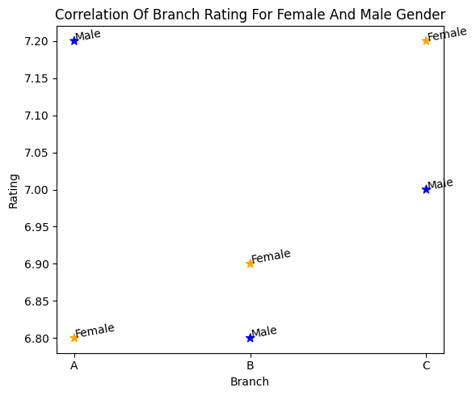
---

**`Chart Analysis:`**

- The chart displays separate clusters for male and female ratings across branches, suggesting potential gender-specific rating patterns. While there's variation within each cluster, Branch C consistently receives high ratings from both genders. 

- Branch A Male has the highest rating than female unlike branches (B, C), in which females have the highest rating.

### **Analysis Of Rating Of Female And Male Gender In Each Branch In Each Month:**
```py
df["month_no"] = df["date_time"].dt.month
df["month_name"] = df["date_time"].dt.strftime("%B")

month_branch_gender_rating = df.groupby(by=["month_name","branch","gender"]).agg(
    rating_mean=("rating","mean")
).round(1)

month_branch_gender_rating_pivot = month_branch_gender_rating.pivot_table(
    index="month_name",
    columns=["branch","gender"],
    values="rating_mean"
)

month_branch_gender_rating_pivot.plot(kind="bar", figsize=(8,6))
plt.title("Gender Rating Mean In Each Branch In Each Month")
plt.xlabel("Month")
plt.ylabel("Rating Mean")
plt.legend(loc="best", title="Gender")
plt.xticks(rotation=0)
plt.tight_layout()
```
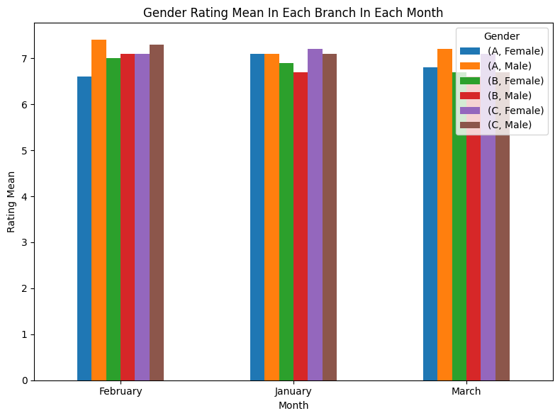
---

**`Chart Analysis:`**

- Overall, female ratings tend to be higher than male ratings across all branches and months.

- Branch A consistently receives the highest average ratings, regardless of gender.

- Branch B shows the least variation in ratings between genders.

- January and March have higher average ratings compared to February.

- There is a slight upward trend in average ratings across all branches from February to March.

# **6. Conclusion:**

**By gaining insights into distribution, customer demographics, branch performance, and customer ratings, several conclusions are drawn from the analysis:** 

1. The majority of transactions generally fall under the tax rate of 20% and are valued at lower than 200, suggesting that activities are concentrated in lower ranges.

2. The branches throw different activity scales, most active in Branch A and highest total value owned by Branch C, implying variables affecting the performance of each branch, which can be as a result of differences in workload, resources, or performance.

3. In measurable terms, the activity level in Yangon is slightly more than that of Mandalay and Naypyitaw signifying a marginally higher demand in this region.

4. The customer demographics portray a fair distribution of both gender dimensions, with females slightly dominating Branch C and then a predominance of males in Branches A and B.

5. E-wallets or mobile wallets form the popular source of payment mode followed by cash; credit card usage lags behind cash, illustrating areas where digital payment would be promoted.

6. Most women tend to rate branches higher across branches than men; Branch A averages the highest rating overall.

7. The ratings given by the men and women differ very little in Branch B though the gender difference ratings are highest in Branch C.

8. Seasonal trends indicate average ratings in January and March, with a slight increase from February to March. 

9. In fact, the distribution of members and Normal customers in terms of the number is almost equal. Thus it shows a healthy balance with some potential in promoting membership.

10. The insight overall from the data is really strategic areas, focusing on resource allocation, targeting marketing, and fine-tuning customer engagement across branches.
